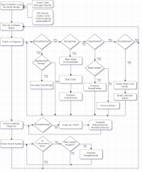
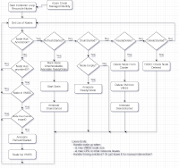

# Ducklett

## Overview

Ducklett is a kubernetes controller that manages updating nodes in a Conducktor cluster.

## Origin

For immutable infrastructure, we need to treat nodes like appliances: we don't update them, we replace them.  We needed a Kubernetes-aware process to see changes in the VMSS imageID value and roll out new nodes with that image, rolling out (deleting) the old nodes.  All while gracefully migrating the workloads to other nodes.

This controller requires special OS images, produced by the Golduck pipeline.  Specifically, they require the /etc/osrelease PRETTY_NAME field to reflect the imageID tag used for the node.  This is then attached to the Kubernetes nodeInfo block for each node.  The controller reads that to determine what OS imageID the node is running on.

## Config Options

This controller requires managed identity to be set up for the nodes that the controller runs on.

A secret is defined in the deploy manifests that contains fields for the SubscriptionID and ResourceGroup, you must supply these values.

Currently you specify these items to the controller as arguments to the container:
- check-period : How often the controller polls the nodes for updates
- worker-concurrency : How many worker nodes to update at a single time
- cp-concurrency: How many controlplane nodes to update at a single time

Example: `ducklett --check-period=30 --concurrency=2 --v=3`

The `--v=3` is optional, and will bump log output verbosity

## Manually updating image in Azure to trigger controller

There is a utility in this repo, `update-azure-image-tags`, that can be used to bump the tags related to the cp and worker nodes for the cluster.  After the tags are bumped to a new version, the controller will begin upgrading the cluster.

Example, to be run inside the container for the controller in the cluster:

`/update-azure-image-tags -imageid conducktor-flatcar-1.20.7-v0.3.0-cc9e4ddc`
