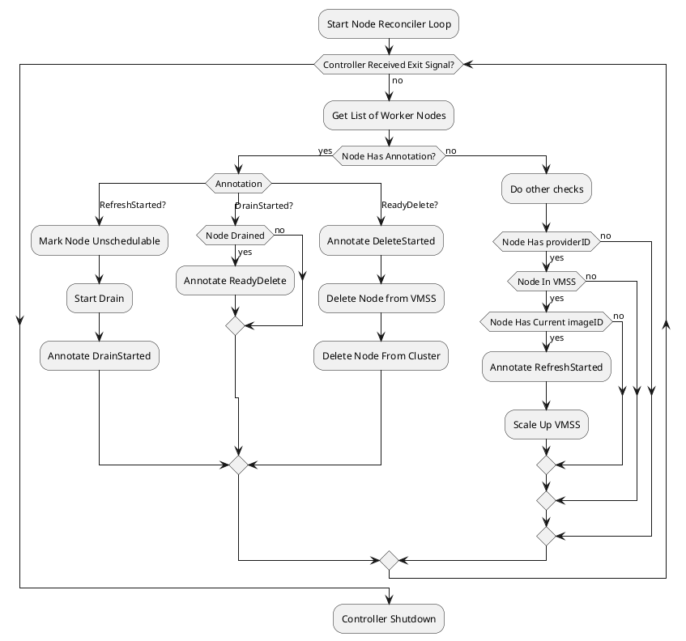

```plantuml
@startuml
:Start Node Reconciler Loop;
while (Controller Received Exit Signal?) is (no)
  :Get List of Worker Nodes;
    if (Node Has Annotation?) then (yes)
      switch (Annotation)
      case (RefreshStarted?)
        :Mark Node Unschedulable;
        :Start Drain;
        :Annotate DrainStarted;
      case (DrainStarted?)
        if (Node Drained) then (yes)
          :Annotate ReadyDelete;
        else (no)
        endif
      case (ReadyDelete?)
        :Annotate DeleteStarted;
        :Delete Node from VMSS;
        :Delete Node From Cluster;
      endswitch
    else (no)
      :Do other checks;
      if (Node Has providerID) then (yes)
        if (Node In VMSS) then (yes)
          if (Node Has Current imageID) then (yes)
            :Annotate RefreshStarted;
            :Scale Up VMSS;
          else (no)
          endif
        else (no)  
        endif
      else (no)
      endif
    endif 
endwhile
:Controller Shutdown;
@enduml
```